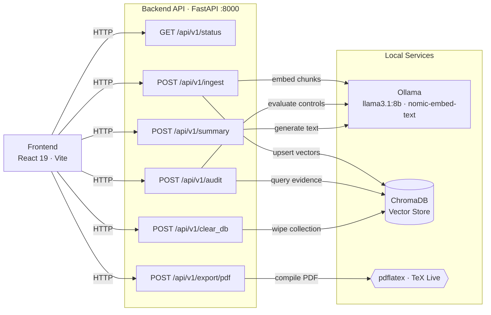

# ComplianceCartridge

An offline, AI-powered compliance analysis engine designed to evaluate your organization's documents against industry standards (such as ISO 27001, GDPR, and SOC 2). By leveraging a local Retrieval-Augmented Generation (RAG) architecture, it produces comprehensive, audit-ready PDF reports without ever sending sensitive data to external servers.

## Key Capabilities

- **Strict Data Privacy**: All document processing, vector embeddings, and LLM inferences occur on your local hardware.
- **Automated Gap Analysis**: Analyzes documents against specific regulatory controls to determine compliance levels (Compliant, Partial, Non-Compliant).
- **Executive Summaries**: Generates multilingual, professional summaries of the audit findings.
- **Professional Deliverables**: Compiles findings into an institutional-grade, color-coded PDF report using LaTeX.

## Architecture



## Tech Stack

- **Backend**: Python, FastAPI, PyMuPDF (PDF parsing), ChromaDB (vector storage)
- **AI/LLM**: Ollama (`llama3.1:8b` for reasoning, `nomic-embed-text` for embeddings)
- **Frontend**: React 19, TypeScript, Vite, Tailwind CSS
- **Document Generation**: TeX Live (`pdflatex`)

## System Requirements

- **Python**: 3.11+
- **Node.js**: 20+
- **Ollama**: 0.1.40+
- **TeX Live**: 2024+
- **Storage**: ~10 GB for AI models

## Installation Guide

### 1. Download Local AI Models

Ensure Ollama is running, then pull the required models:

```bash
ollama serve &
ollama pull llama3.1:8b
ollama pull nomic-embed-text
```

### 2. Install TeX Live

Required for generating PDF reports locally.

- **Arch Linux (using pacman or yay)**:
  ```bash
  sudo pacman -S texlive-basic texlive-latexextra texlive-fontsrecommended
  # or via yay:
  yay -S texlive-basic texlive-latexextra texlive-fontsrecommended
  ```
- **Fedora**:
  ```bash
  sudo dnf install -y texlive-scheme-basic texlive-collection-latexextra texlive-collection-fontsrecommended
  ```
- **Debian / Ubuntu**:
  ```bash
  sudo apt install texlive-latex-extra texlive-fonts-recommended
  ```
- **macOS**:
  ```bash
  brew install --cask mactex-no-gui
  ```

### 3. Setup Backend

Initialize the Python environment and install dependencies:

```bash
cd backend
python -m venv venv
source venv/bin/activate
pip install fastapi uvicorn httpx pydantic chromadb pymupdf
```

### 4. Setup Frontend

Install the React dependencies:

```bash
cd frontend
npm install
```

## Running the Application

Launch the required services in three separate terminal windows:

1. **Ollama Service**:
   ```bash
   ollama serve
   ```

2. **Backend API**:
   ```bash
   cd backend
   source venv/bin/activate
   python main.py
   # Runs at http://localhost:8000 (Swagger docs available at /docs)
   ```

   On a low-RAM machine, see [Performance & Low-RAM Tuning](#performance--low-ram-tuning)
   for env vars to export before starting the API.

3. **Frontend Application**:
   ```bash
   cd frontend
   npm run dev
   # Runs at http://localhost:5173
   ```

## How the Pipeline Operates

1. **Ingestion**: Uploaded documents are parsed into text chunks, embedded via the `nomic-embed-text` model, and stored locally in a ChromaDB database.
2. **Evaluation**: When auditing against a standard, the system searches the vector database for relevant evidence. The `llama3.1` model then analyzes the retrieved content to determine a compliance status and formulate recommendations.
3. **Scoring**: The overall compliance posture is quantified using a weighted metric:

   $$
   \text{Trust Score} = \frac{\sum_i w_i \cdot s_i}{\sum_i w_i} \times 100
   $$

   *(where $w_i$ represents the weight of a given control and $s_i$ represents the compliance score achieved for that control).*
4. **Executive Summary**: The LLM crafts a professional, translated summary of the audit findings in your chosen language.
5. **PDF Export**: The system dynamically generates a LaTeX document containing the detailed findings, scores, and summary. It compiles this document locally into a color-coded, ready-to-share PDF report.

## Frontend Overview

The web interface is designed for simplicity and efficiency:
- **Document & Standard Selection**: Easily upload PDFs and choose from built-in or custom compliance frameworks.
- **Audit Dashboard**: View high-level metrics, an interactive compliance heatmap, and an ordered list of findings based on severity.
- **Report Management**: Generate AI summaries, preview results, and export professional PDF deliverables directly from the browser. Local storage retains previous audits and uploaded documents for quick access.

## Supported Frameworks

The system includes pre-configured controls for:
- ISO 27001 (Information Security)
- ISO 9001 (Quality Management)
- ISO 14001 (Environmental Management)
- ISO 45001 (Occupational Health & Safety)
- GDPR (Data Protection)
- SOC 2 (Service Organization Controls)

Custom standards can also be defined and imported directly via the frontend dashboard.

## Configuration Options

Default settings can be adjusted in the backend configuration files (`main.py` and `evaluator.py`):
- API timeouts and Ollama URL endpoints
- Specific LLM model choices
- PDF file size limits and compilation timeouts

## Performance & Low-RAM Tuning

Most of the memory that this stack consumes lives in **Ollama**, not the Python
backend. When an audit runs, Ollama keeps the LLM model (`llama3.1:8b`, ~4-5 GB
at its default 4-bit quantization) resident for the entire run, plus a growing
context cache — which can choke machines with 8 GB of RAM or less. The backend
itself only sends HTTP requests; it does not hold the model in memory.

There are several ways to reduce the footprint without touching the code.

### 1. Tune Ollama itself (biggest impact)

Export these **before running `ollama serve`** to stop the server from keeping
multiple models / requests in memory at once and to free RAM quickly when idle:

```bash
export OLLAMA_MAX_LOADED_MODELS=1      # load one model at a time
export OLLAMA_NUM_PARALLEL=1           # handle one request at a time
export OLLAMA_KEEP_ALIVE=2m            # unload model 2 min after last use
export OLLAMA_FLASH_ATTENTION=1        # smaller KV cache where supported
ollama serve
```

### 2. Switch to a smaller LLM

The biggest single win is a smaller reasoning model. The backend takes the model
name from the `OLLAMA_MODEL` env var, so you can downgrade without code changes:

```bash
ollama pull llama3.2:3b        # ~2 GB — good balance on 8 GB machines
# or even lighter:
ollama pull llama3.2:1b        # ~1.3 GB — best for very constrained boxes
```

```bash
export OLLAMA_MODEL=llama3.2:3b
```

For embeddings, `nomic-embed-text` (~270 MB) is already small, but you can pick
another embedder via `OLLAMA_EMBED_MODEL`.

### 3. Shrink the context window (backend env vars)

These are read by the backend to build the Ollama `options` block for every call:

| Env var | Default | Purpose |
| --- | --- | --- |
| `LLM_NUM_CTX` | `4096` | Context window (tokens). Lower = smaller KV cache = less RAM. |
| `LLM_NUM_THREAD` | `0` | 0 lets Ollama decide. Cap it (e.g. `4`) to keep other apps responsive. |
| `LLM_KEEP_ALIVE` | `5m` | How long the model stays loaded after each call. `0` unloads immediately, `30s` is a good low-RAM compromise. |
| `OLLAMA_TIMEOUT` | `120` | Per-call HTTP timeout (seconds). |
| `OLLAMA_URL` | `http://localhost:11434/api/generate` | Override the LLM endpoint. |
| `OLLAMA_BASE_URL` | `http://localhost:11434` | Base URL used for the health check (main.py). |
| `CHROMA_PATH` | `./chroma_db` | Where the vector store lives (ingestion.py). |

### 4. Low-RAM pacing mode

Set `COMPLIANCE_LOW_RAM=1` to slow the audit loop down a little (a short pause
between control evaluations) so the OS and other apps get breathing room:

```bash
export COMPLIANCE_LOW_RAM=1
export COMPLIANCE_LOW_RAM_PAUSE=1.5    # optional, seconds between controls
export LLM_NUM_THREAD=2                # optional: cap CPU cores used by Ollama
python main.py
```

A good starting point for an **8 GB machine**:

```bash
export OLLAMA_MAX_LOADED_MODELS=1
export OLLAMA_NUM_PARALLEL=1
export OLLAMA_KEEP_ALIVE=2m
export OLLAMA_FLASH_ATTENTION=1
export LLM_NUM_CTX=2048
export LLM_NUM_THREAD=4               # reserve cores for multitasking
export COMPLIANCE_LOW_RAM=1
export COMPLIANCE_LOW_RAM_PAUSE=1.0
export OLLAMA_MODEL=llama3.2:3b        # optional: drop from 8b to 3b
```